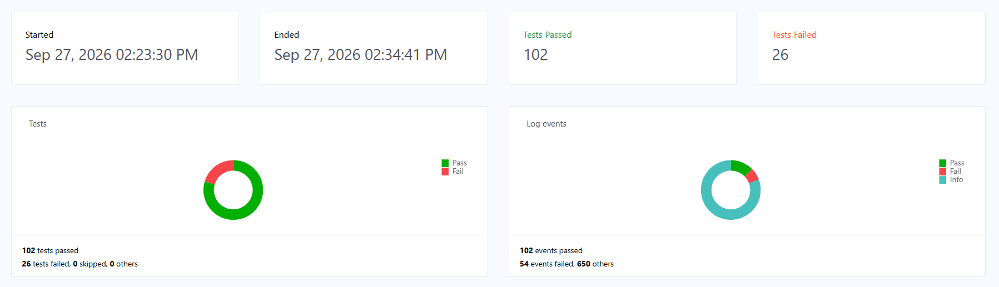
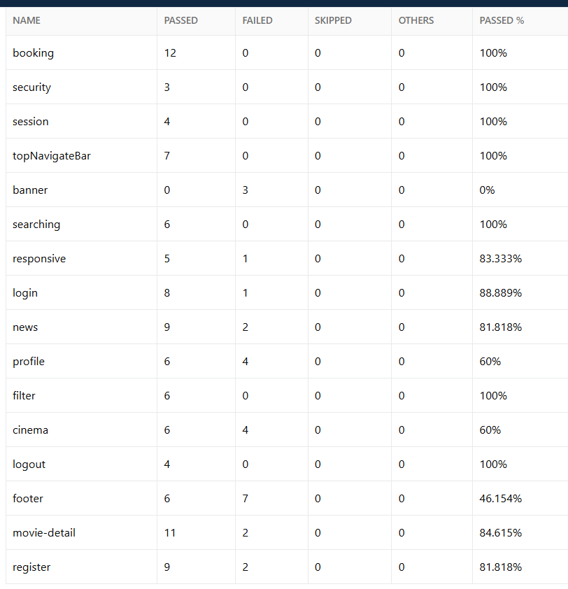

# 🎬 Movie Booking Automation Testing

Automation Testing project for a movie booking website, built with **Java, Selenium WebDriver, TestNG, Gradle and ExtentReports**.

The project is developed following the **Page Object Model (POM)** approach with reusable page components, centralized test data, TestNG Groups, parallel test execution, logging and automated test reporting.

---

## 📌 Project Overview

This project focuses on automating functional test cases for a movie booking website.

The main testing areas include:

* Login / Logout
* User Registration
* User Profile
* Movie Search
* Movie Details
* Cinema System
* Movie Filtering
* Movie Booking
* Banner
* Navigation Bar
* Footer
* News
* Session
* Responsive UI
* Security-related test cases

The framework is organized so that page interactions, test data and test cases are separated, making the automation code easier to reuse and maintain.

---

## 🛠️ Tech Stack

| Technology         | Version / Details       |
| ------------------ | ----------------------- |
| Java               | JDK 21                  |
| Selenium WebDriver | 4.47.0                  |
| TestNG             | 7.12.0                  |
| Gradle             | 9.3.0                   |
| Log4j              | 2.26.1                  |
| ExtentReports      | 5.1.2                   |
| IDE                | IntelliJ IDEA           |
| Browser            | Chrome / Firefox / Edge / Safari |

---

## 🏗️ Framework Architecture

The project follows the **Page Object Model (POM)** design pattern.

```text
movie_booking
│
├── src
│   ├── main
│   │   └── java
│   │       ├── base
│   │       │   ├── BasePage.java
│   │       │   └── BaseTest.java
│   │       │
│   │       ├── constants
│   │       │   └── TimeOutConstants.java
│   │       │
│   │       ├── data
│   │       │   └── TestDataProvider.java
│   │       │
│   │       ├── driver
│   │       │   ├── DriverManager.java
│   │       │   ├── DriverManagerFactory.java
│   │       │   ├── ChromeDriverManager.java
│   │       │   ├── EdgeDriverManager.java
│   │       │   ├── FirefoxDriverManager.java
│   │       │   └── SafariDriverManager.java
│   │       │
│   │       ├── pages
│   │       │   ├── BookingPage.java
│   │       │   ├── CinemaPage.java
│   │       │   ├── CommonPage.java
│   │       │   ├── HomePage.java
│   │       │   ├── LoginPage.java
│   │       │   ├── MovieDetailPage.java
│   │       │   ├── ProfilePage.java
│   │       │   ├── RegisterPage.java
│   │       │   │
│   │       │   ├── components
│   │       │   │   ├── Banner.java
│   │       │   │   ├── Filter.java
│   │       │   │   ├── Footer.java
│   │       │   │   ├── LogOut.java
│   │       │   │   ├── News.java
│   │       │   │   ├── Searching.java
│   │       │   │   ├── Session.java
│   │       │   │   └── TopNavigation.java
│   │       │   │
│   │       │   └── modals
│   │       │       └── CommonModal.java
│   │       │
│   │       ├── report
│   │       │   └── ExtentReportManager.java
│   │       │
│   │       └── untils
│   │           └── ConfigManager.java
│   │
│   └── test
│       ├── java
│       │   └── testcase
│       │       ├── BannerTest.java
│       │       ├── BookingTest.java
│       │       ├── CinemaTest.java
│       │       ├── FilterTest.java
│       │       ├── FooterTest.java
│       │       ├── LogOutTest.java
│       │       ├── LoginTest.java
│       │       ├── MovieDetailTest.java
│       │       ├── NewsTest.java
│       │       ├── ProfileTest.java
│       │       ├── RegisterTest.java
│       │       ├── ResponsiveTest.java
│       │       ├── SearchingTest.java
│       │       ├── SecurityTest.java
│       │       ├── SessionTest.java
│       │       └── TopNavigateBarTest.java
│       │
│       └── resources
│           ├── configure.properties
│           ├── extent-config.xml
│           ├── extent.properties
│           ├── extent-pdf-config.yml
│           ├──  log4j2.xml
│           └── testng-parallel.xml
│
├── docs
│   └── images
│       └── extent-report-sample.png
│
├── build.gradle
├── settings.gradle
├── gradlew
├── gradlew.bat
├── .gitignore
└── README.md
```

---

## 🧩 Framework Components

### Base Layer

**BaseTest**

* Initializes ExtentReports before the test suite
* Loads test configuration
* Creates a WebDriver before each test method
* Creates an ExtentReport test and assigns its TestNG Groups
* Captures a screenshot when a test fails
* Closes the WebDriver after each test
* Flushes the ExtentReport after the suite finishes

**BasePage**

* Common Selenium actions
* Element interaction
* Explicit waits
* Reusable page-level methods

---

### Driver Management

The framework uses a Driver Manager structure to support multiple browsers:

```text
DriverManager
      │
      └── DriverManagerFactory
              │
              ├── ChromeDriverManager
              ├── EdgeDriverManager
              ├── FirefoxDriverManager
              └── SafariDriverManager
```

The browser is selected from `configure.properties` without changing the test classes.

---

### Page Object Model

Each major feature has its own Page class.

For example:

```text
LoginTest
    ↓
LoginPage
    ↓
CommonModal / HomePage
```

The test cases focus on **test flow and verification**, while Page Objects and reusable components handle Selenium interactions and locators.

---

### Reusable Components

Common UI elements are separated into reusable components.

Examples:

* `TopNavigation`
* `Filter`
* `Searching`
* `Banner`
* `Footer`
* `News`
* `Session`
* `LogOut`
* `CommonModal`

This helps avoid duplicating the same Selenium logic across multiple Page classes.

---

## 🧪 Test Coverage

The project contains test classes covering the following functional areas:

| Test Class | Test Area |
| --- | --- |
| `LoginTest` | Login functionality |
| `LogOutTest` | Logout functionality |
| `RegisterTest` | User registration |
| `ProfileTest` | User profile |
| `BookingTest` | Movie booking |
| `MovieDetailTest` | Movie details |
| `CinemaTest` | Cinema functionality |
| `FilterTest` | Movie filtering |
| `SearchingTest` | Movie search |
| `BannerTest` | Homepage banners |
| `TopNavigateBarTest` | Top navigation |
| `FooterTest` | Footer links |
| `NewsTest` | News functionality |
| `SessionTest` | Session-related functionality |
| `ResponsiveTest` | Responsive UI |
| `SecurityTest` | Security-related scenarios |

---

## 🏷️ TestNG Groups

Test cases are organized using TestNG Groups so that tests can be identified by functional area.

Groups currently used in the project:

```text
banner
booking
cinema
filter
footer
login
logout
movie-detail
news
profile
register
responsive
searching
security
session
topNavigateBar
```

Each test is also assigned to its group in ExtentReports, making it easier to filter and navigate the generated report.

Example:

```java
@Test(
    dataProvider = "booking-valid-seat",
    dataProviderClass = TestDataProvider.class,
    groups = "booking"
)
```

### Run a specific TestNG Group

The included `testng-parallel.xml` runs the complete `testcase` package. To run only one group, create or use a TestNG suite with a group filter:

```xml
<groups>
    <run>
        <include name="booking"/>
    </run>
</groups>
```

For example, replace `booking` with `login`, `register`, `cinema`, `searching`, etc. when you want to execute another functional group.

In IntelliJ IDEA, you can also create a **TestNG Run Configuration** and select the required Groups.

---

## 📊 Test Design Techniques

The project applies common black-box testing techniques across its test scenarios, including:

* Equivalence Partitioning (EP)
* Boundary Value Analysis (BVA)
* Decision Table Testing
* Positive Testing
* Negative Testing
* Functional Testing
* Regression Testing
* Smoke Testing
* Exploratory Testing

---

## 📦 Test Data Management

Test data is centralized in:

```text
src/main/java/data/TestDataProvider.java
```

The framework uses TestNG `@DataProvider` to keep test data separate from test logic.

Example:

```java
@Test(
    dataProvider = "register-existing-email",
    dataProviderClass = TestDataProvider.class
)
public void verify_Register_With_Existing_Email(
        String account,
        String password,
        String name,
        String email) {

    // Test steps
}
```

This allows test methods to reuse centralized data while keeping the test flow clean.

Some registration data is generated with `UUID` so that new account/email values can be created for each DataProvider invocation.

---

## ⚠️ Important: Booking Seat Test Data

Booking tests use seat data that depends on the current state of the demo website. A seat selected by one successful booking can become unavailable for a later execution.

When cloning the project, **check the seat data before running the booking tests**.

### `booking-valid-seat`

This DataProvider is used by:

```text
verify_Booking_Successfully
```

Current sample data:

```text
Movie    : gái già lắm chiêu
Schedule : 21-12-2021
numSeat  : 15
```

If seat `15` is already booked or unavailable, change `numSeat` in `TestDataProvider.java` to another available seat for the same movie and schedule.

```java
@DataProvider(name = "booking-valid-seat")
public static Object[][] bookingValidSeat() {
    return new Object[][]{
            {
                    "Clara",
                    "Clara@2026",
                    "gái già lắm chiêu",
                    "21-12-2021",
                    "15" // Change to an available seat when necessary
            }
    };
}
```

### `booking-seat-status-after-booking`

This DataProvider is used by:

```text
verify_Seat_Status_After_Booking
```

Current sample data:

```text
Movie    : gái già lắm chiêu
Schedule : 21-12-2021
seatSold : X
numSeat  : 14
```

The test books `numSeat` and then verifies that the seat is displayed as sold with the expected status `X`.

If seat `14` is already booked when you clone/run the project, change `numSeat` to another available seat. Keep the expected `seatSold` value as `X` unless the application behavior being tested changes.

```java
@DataProvider(name = "booking-seat-status-after-booking")
public static Object[][] bookingStatusSeat() {
    return new Object[][]{
            {
                    "Clara",
                    "Clara@2026",
                    "gái già lắm chiêu",
                    "21-12-2021",
                    "X",
                    "14" // Change to an available seat when necessary
            }
    };
}
```

### Quick check before running booking tests

```text
1. Open TestDataProvider.java
2. Find booking-valid-seat
3. Check whether numSeat is still available
4. Change numSeat if the seat is already booked
5. Find booking-seat-status-after-booking
6. Check/change numSeat if necessary
7. Keep seatSold = "X" for the sold-seat verification
8. Run the booking test/group
```

> **Note:** The movie, schedule and seat availability come from the shared demo website and may change over time. If the selected movie/schedule is no longer available, the corresponding test data may also need to be updated.

---

## ⚡ Parallel Test Execution

TestNG is configured to execute test classes in parallel.

Configuration in `testng-parallel.xml`:

```xml
<suite name="Parallel Test Suite"
       parallel="classes"
       thread-count="5">
```

The suite executes the `testcase` package and allows up to **5 test classes to run concurrently**.

The ExtentReport implementation uses `ThreadLocal<ExtentTest>` so each parallel test thread has its own ExtentReport test instance.

---

## 📝 Logging

The framework uses **Log4j 2** for test execution logging.

Example:

```java
LOG.info("Step 1: Click on Login");
```

Logs can be used to:

* Track test execution
* Debug failures
* Understand test flow
* Investigate unexpected behavior

Log4j configuration is located at:

```text
src/test/resources/log4j2.xml
```

---

## 📈 Test Reporting

The project integrates **ExtentReports 5.1.2** for HTML test reporting.

The report records:

* Test case name
* TestNG Group / category
* Test execution steps
* Pass / Fail status
* Execution information
* Failure information
* Screenshots for failed tests

The project also enables TestNG's default reporting output.

### ExtentReport Sample

The generated report has a dashboard showing the execution summary and timeline.




### Generated report location

The custom ExtentReport is generated under:

```text
testReport_output/
└── ExtentReport_<timestamp>.html
```

Screenshots captured for failed tests are stored under:

```text
testReport_output/screenshots/
```

TestNG's built-in output is stored under:

```text
test-output/
```

### How screenshots work

When a test fails, `BaseTest.afterMethod()` calls the ExtentReport manager to:

1. Capture the current browser screenshot.
2. Save it under `testReport_output/screenshots/`.
3. Attach the screenshot to the failed test in ExtentReports.

---

## ⚙️ Configuration

Main test configuration is located at:

```text
src/test/resources/configure.properties
```

Current configuration:

```properties
platform=web
browser=chrome
baseUrl=https://demo1.cybersoft.edu.vn
headless=false
maximize=true
timeout=10
```

Supported browser values in `DriverManagerFactory` are:

```text
chrome
firefox
edge
safari
```

To change the browser, update:

```properties
browser=chrome
```

For example:

```properties
browser=firefox
```

The browser must be installed on the machine where the tests are executed.

---

## ▶️ How to Run

### 1. Clone the repository

```bash
git clone https://github.com/NguyenTanPhu2/Movie_Booking_Automation.git
cd Movie_Booking_Automation
```

### 2. Open the project

Open the project using **IntelliJ IDEA** and import it as a Gradle project.

Make sure the following are available:

```text
JDK 21
Git
A supported browser
Internet/network access
```

The project includes the **Gradle Wrapper**, so a separate Gradle installation is normally not required.

### 3. Check Java

```bash
java -version
```

The project is configured for Java 21.

### 4. Run all tests

**Windows Command Prompt:**

```bash
gradlew.bat test
```

**Windows PowerShell:**

```powershell
.\gradlew.bat test
```

**macOS / Linux:**

```bash
./gradlew test
```

The Gradle `test` task uses `testng-parallel.xml`, which runs the `testcase` package with TestNG parallel execution.

### 5. Run from IntelliJ IDEA

You can also run:

```text
testng-parallel.xml
```

as a **TestNG Suite** from IntelliJ IDEA.

For a smaller execution, run an individual test class or configure a TestNG Group from an IntelliJ TestNG Run Configuration.

---

## 🌐 Test Environment

The automation tests are designed for the CyberSoft movie booking demo website:

```text
https://demo1.cybersoft.edu.vn
```

> The website is a shared testing/demo environment. Application data, movies, schedules and seat availability may change over time.

---

## 🔍 Example Test Flow

### Login

```text
Open Movie Booking Website
        ↓
Navigate to Login
        ↓
Enter Username
        ↓
Enter Password
        ↓
Click Login
        ↓
Verify Login Result
        ↓
Verify User Information
```

### Booking

```text
Select Movie
      ↓
Select Cinema / Schedule
      ↓
Select Seat
      ↓
Enter / Confirm Booking Information
      ↓
Confirm Booking
      ↓
Verify Booking Result
```

---

## 🎯 Project Goals

The main goals of this project are:

* Practice Selenium WebDriver automation
* Build a reusable automation framework
* Apply Page Object Model
* Organize test cases with TestNG Groups
* Implement reusable test data with `@DataProvider`
* Execute test classes in parallel
* Implement automated test reporting
* Improve debugging through logging
* Practice real-world QA automation workflows

---

## 🚀 Future Improvements

Possible improvements for future versions:

* [ ] Add CI/CD with GitHub Actions
* [ ] Add cross-browser execution through configuration
* [ ] Improve ExtentReports test-step organization
* [ ] Add screenshot automatically for every required failure scenario
* [ ] Add more API testing with REST Assured
* [ ] Improve configuration management
* [ ] Add environment-specific test configuration
* [ ] Expand automation coverage
* [ ] Integrate test reports into CI/CD pipeline

---

## 👨‍💻 Author

**Nguyễn Tấn Phú**

Automation Testing / QA Engineer

Skills demonstrated in this project:

```text
Java
Selenium WebDriver
TestNG
Gradle
Page Object Model
DataProvider
TestNG Groups
XPath
Explicit Wait
Log4j
ExtentReports
Parallel Testing
Functional Testing
```

---

## 📄 License

This project is created for **learning, testing and portfolio purposes**.
